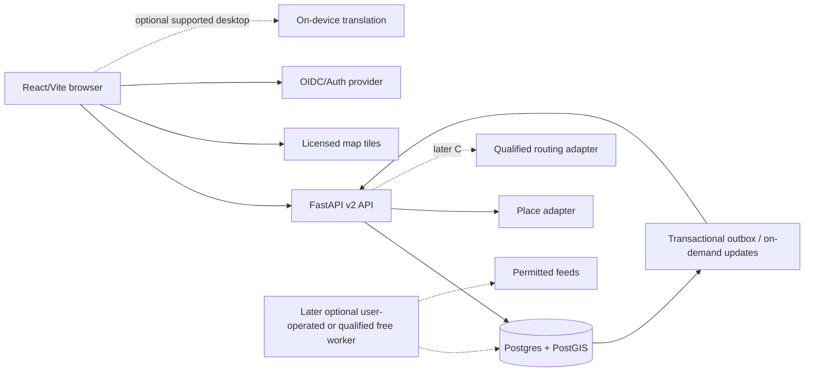

# Payanam global travel product — Astra draft

**Status:** Draft for review, 7 October 2026. This document proposes a product direction and a first delivery boundary. It does not approve implementation, change a deployment, establish provider accounts, or claim new capabilities are live. The companion [roadmap draft](../plans/2026-10-07-payanam-global-roadmap-draft.md) is an execution proposal, not an approved implementation plan.

**Intent:** Turn Payanam into a useful, free-to-use and self-hostable travel planner grounded in real places, with maps, multilingual use, secure saved trips, trustworthy updates, and sustainable operation. **The user requires strictly ₹0 recurring infrastructure charges at launch: no paid dependencies, automatic upgrades, or silent overages.** Retain the promise: **Travel with confidence. Keep the moments that matter.**

**Working assumptions:** Start with family organizers and small travel operators in India; support global place discovery from the first new slice. Prove travel-data quality in selected Indian destinations before advertising dependable global itinerary automation. “Global search,” “supported routing,” “verified venue hours,” and “live transport” are separate coverage claims. This is planning software; ticketing, paid supplier bookings, emergency response, and guaranteed accessibility are separate future products.

## Executive decision summary

**Recommended product:** An India-first family travel planner that can discover real places worldwide, explains what is known or uncertain, and helps families preserve meaningful visits within time, comfort and budget constraints. Start with family organizers and local operators as a customer hypothesis, not an already validated market.

**Build versus adopt:** Keep Payanam provisionally because its React/FastAPI product and OR-Tools family constraints already work. First run a bounded comparison against [TREK](https://github.com/liketrek/TREK), the closest found open-source product (14,619 stars observed 7 October 2026, AGPL-3.0). TREK supplies many desired commodity features but would need an India-language/data adaptation, provider-policy audit, and compatible integration of our solver. Payanam's missing upstream license must be resolved; if it cannot be, a clearly licensed replacement/adoption becomes preferable to extending restricted code. Do not copy TREK code into Payanam without applying its license obligations.

**₹0 launch profile:** A bounded, best-effort pilot on provider subdomains, with quota stops and recovery states. MapLibre + OpenFreeMap basemap; a free Geoapify account for submitted search after account-level zero-billing verification; Supabase Free Auth/Postgres/PostGIS when a project ID is supplied; free API hosting with cold starts; a free commercial-eligible static host after its applicable terms are checked. Render Free Postgres is unsuitable because it expires. No always-on or production SLA, purchased domain, paid translation/weather service, background-worker subscription, or automatic billed fallback is included.

**Language and freshness:** Complete human-reviewed English/Tamil UI and phrasebooks first. Desktop Chrome translation is an optional supported-pair enhancement; mobile/Firefox/Safari retain originals and phrasebooks. Source-aware, durable on-demand refresh comes before scheduled ingestion; save/sync events and observed travel updates have distinct labels. Global live traffic, universal translation and real transport inventory are not launch claims.

**First shippable slice:** Search a real Indian and international place, see source/attribution and map, add places to a dated trip, sign in, save/reopen from another session, export and delete. Two accounts must be isolated. Unknown hours/prices/access remain unknown. The v1 illustrative Madurai planner and signed saves stay compatible in a separate legacy mode.

**Money and execution:** The launch price is ₹0 and recurring infrastructure spend is ₹0. Future INR subscription/assisted-service ideas are research hypotheses only; a funded commercial operating profile needs a separate decision. Missing inputs are the DB/auth project ID, free provider key and zero-billing controls, eligible hosting connections, upstream rights resolution, and approval of B's scope/execution plan. None of the proposed integrations is live yet.

Evidence, official policies, competitor prices, dated license/star observations and the Madurai/Paris source probes are in [real-data and zero-cost research](../../startup/REAL-DATA-RESEARCH-2026-10-07.md). Those probes establish source retrieval only, not global quality or current opening hours.

## 1. What exists and what this proposal changes

The existing React 19 / TypeScript / Vite 8 frontend and FastAPI / OR-Tools planning service are usable public previews. The six-place Madurai catalog uses real place names but illustrative hours, fares, and distance-derived travel estimates. The map is an SVG sketch. Saves are browser-local; exports and delay alternatives use schema version 1 and server HMAC signatures. English and Tamil navigation exist, with incomplete full-interface localization. The legacy distributed transit prototype is separate from the public planning entrypoint.

Current URLs are https://payanam-journeys.vercel.app and https://payanam-planning-api.vercel.app. Existing verification is recorded in [deployment status](../../DEPLOYMENT-STATUS.md): 21 planning tests and 9 browser tests passed at the prior release. These counts are historical evidence, not tests of this draft. The full legacy suite has known failures; do not describe the entire repository as passing.

The first new release adds authentic global place discovery, a real map, identity, and private cloud trips. It does **not** quietly feed arbitrary global coordinates into the existing Madurai solver. The legacy preview stays clearly marked and is eventually moved behind an “Illustrative demo” entry point. New user trips contain sourced facts and explicit unknowns, never seeded sample fares or invented availability.

## 2. Positioning and competitive direction

TripMapper is a product reference for day-by-day cards/lists, time fields, budget, collaboration, offline use, tasks and attachments advertised on its official pages. Its published currency conversion is limited by available ECB rates. The public desktop marketing image shows day columns and category cards; Payanam should pair that organization with a map and more legible mobile/local-script controls. The observed personal offer was £3.99/month; business monthly EUR variants were €89.99/€244.99/€424.99, not directly comparable INR quotes. Reuse useful interaction conventions, not its brand, copy, layouts, images, or proprietary content. Product comparisons must be limited to features documented on its public site; an unmentioned capability is unknown, not absent.

Payanam's proposed differentiator is an **evidence-aware family planner**:

- Every consequential fact exposes source, freshness, and uncertainty: a sourced opening window differs from a traveler note, a route estimate, or a live delay.
- A family can set rest time, walking tolerance, step-free preferences, spending limits, and must-see visits. Unknown accessibility remains unknown; the app never infers wheelchair access from venue category.
- A change opens a before/after proposal showing affected visits, added walking, time, and money. Completed visits remain fixed. Applying a proposal creates a revision; restoring an earlier revision creates another revision rather than erasing history.
- Local names and human-reviewed travel language remain available alongside translations. The organizer can share a readable, low-bandwidth trip with relatives who do not use the same language.
- A trip budget tracks estimates and recorded expenses by category and currency, without pretending an estimated taxi fare is a bookable offer.

These are hypotheses to validate, not evidence that Payanam is already unique or better. The first measurable job is: a family organizer can assemble a real, understandable trip and retrieve it on a second device without losing source context.

## 3. Scope as independent, shippable workstreams

| Workstream | Independently useful output | Dependencies and exit gate |
|---|---|---|
| A. Rights, data, and product validation | License inventory, TREK comparison spike, provider register, coverage benchmark, interview evidence | Before public open-source/commercial claims or provider commitment |
| B. Real discovery and private trips | Search real places, map/list, sign in, save/reopen/export owner trips | Approved B spec; enforceable ₹0 provider and DB/auth targets; public-browser acceptance |
| C. Evidence-based day planning | Road routes, sourced hours, family constraints, explained alternatives | B plus routing/data qualification; separate C spec and plan |
| D. Multilingual travel tools | Complete reviewed UI locales and bounded text translation | B; model/license/quality gates; separate D spec and plan |
| E. Collaboration and trip money | Owner/editor/viewer roles, revocable sharing, expenses and revisions | B ownership proven; permission and monetary invariants; separate E spec and plan |
| F. Freshness and travel updates | Durable ingestion, user-visible freshness, bounded SSE/poll updates, proposed replans | B/C; actual permitted feeds and worker host; separate F spec and plan |
| G. Sustainable hosted service | Measured free-quota use, operator pilot, future price research | ₹0 launch; billing only after demand, rights and a separately funded eligible hosting profile |

B is the first implementation candidate. The roadmap provides detail for B and qualification tasks for later streams. Do not implement all seven from this master document in one branch.

## 4. Architecture options and recommendation

| Option | Strengths | Costs and limits | Decision |
|---|---|---|---|
| Keep current app, add portable Postgres/PostGIS, JWT auth, MapLibre, provider adapters | Reuses working code and tests; relational ownership and spatial queries; supports managed or self-hosted deployment | Requires deliberate identity/RLS boundary and provider operations | **Recommended** |
| Adopt TREK and integrate a Payanam planning service | Existing day boards, budgets, collaboration and offline features on an explicitly AGPL-licensed foundation | Product migration, India locale/data work, AGPL obligations, provider defaults and ₹0 deployability require audit | Run a bounded comparison spike; preferable if Payanam rights cannot be resolved |
| Operate global tiles, geocoding, routing, translation, identity, and DB immediately | Maximum infrastructure control and open stack | Large imports, storage, updates, RAM/GPU/CPU costs, backup and on-call work before validation | Regional self-host option later, not the initial global launch dependency |

Recommended boundaries:



Keep `app.planning.main:app` as the entrypoint, mount a new `app/travel/api.py` router under `/api/v2`, and preserve `/api/v1` as-is. Domain packages expose typed interfaces; business logic must not depend on a provider response shape. Postgres migrations use Alembic and SQLAlchemy, with PostGIS for geography. Pin actual dependency versions during implementation after compatibility checks; no dependency installation is authorized by this draft.

Use MapLibre GL JS as the browser renderer and OpenFreeMap as the default basemap. OpenFreeMap explicitly offers its public instance free for commercial use without keys/request limits, but without an SLA or personal support. Preserve OpenMapTiles/OSM attribution, style/font notices and a configurable endpoint. Search uses a registered Geoapify Free account with a backend key, attribution and a hard internal credit reserve. No public demo geocoder is the production default. Geoapify permits caching/storing generated results with attribution; export and redistribution still follow its terms and ODbL. Because its terms allow suspension **or overage charges**, account-level enforceable zero-billing behavior is a release gate: no card/paid plan, no shared uncontrolled key usage, and explicit provider verification. Internal quotas alone cannot guarantee that another key consumer never creates a bill. If zero billing cannot be ensured, disable that service and revise the provider choice.

Supabase Free is the preferred managed Auth/Postgres/PostGIS candidate **if a project target is supplied**, subject to current availability. The observed free allowance is 500 MB DB, 5 GB egress plus 5 GB cached egress, 1 GB object storage and two active projects; projects pause after a week inactive, with no automated backups or SLA. Keep user trips and a small licensed cache, not a global POI mirror. Make encrypted manual/local backups and rehearse restore. Portable OIDC + Postgres on user-owned hardware is an alternative, with hardware/electricity/maintenance borne by its operator; do not call that zero-resource operation. No Supabase project ID or authorized DB target is currently known.

For hosting, preserve existing Vercel URLs as a personal preview only while eligible: Vercel Hobby explicitly restricts noncommercial personal use. Cloudflare Pages is the free static-hosting candidate for commercial intent, subject to applicable account/product terms; observed limits include 500 builds/month, 20,000 files and 25 MiB/file. Render Free is a best-effort pilot API candidate once connected: sleeps after 15 idle minutes, roughly one-minute wake, 750 shared monthly instance-hours and ephemeral disk; its documentation discourages production use. **Never use Render Free Postgres for lasting trips:** it expires after 30 days with a 14-day grace period and no backups. Add no payment-linked overage risk, keepalive scheme or paid worker. Free quotas can suspend service; the UX must preserve drafts and explain retry/paused states.

F first delivers durable on-demand refresh and revision polling. A sleeping API cannot promise periodic ingestion or reliable long-lived SSE. A later user-operated worker or verified eligible free executor is optional; absent one, periodic feeds remain unavailable. No queue/translation/map service account is created by this draft. User device/data costs and human labor still exist; ₹0 here is the recurring hosted-infrastructure bill constraint, not a promise that worldwide computing costs nothing.

## 5. Provider and licensing strategy

Each adapter implements `capabilities()`, a region/language capability manifest, and source attribution. Provider choice is configuration, but fallback is permitted only when terms, identity mapping, and provenance are compatible. Never blend proprietary cached records into an open database merely because both expose coordinates.

| Domain | Initial recommendation | Open alternative / later option | Important boundary |
|---|---|---|---|
| Map rendering | MapLibre GL JS | Same renderer | Renderer license is separate from data and tiles |
| Tiles and search | OpenFreeMap tiles; Geoapify Free search (3,000 credits/day) after zero-billing verification | Regional user-hosted tiles/geocoder when resources exist | Global Photon self-host (~95 GB data, ~64 GB RAM recommended) is not a ₹0 cloud plan; public demos have no SLA |
| Place data | OSM-derived records with provenance; authoritative venue links where available | Curated local verification and licensed enrichment | Real names/coordinates do not prove current opening hours, access, prices, or safety |
| Roads | Later C: qualify Geoapify Free routing within credits and region coverage | User-hosted Valhalla or OSRM regional service | Road-time estimate is not live traffic; matrix credits can dominate the free budget |
| Scheduled transit | Only licensed official/agency GTFS where obtained | OpenTripPlanner/MOTIS after feed validation | No invented India-wide train/bus availability; GTFS static differs from GTFS-Realtime |
| Weather | Disabled by default for commercial ₹0 launch until an eligible free source is proven | Open-Meteo free only for eligible noncommercial/evaluation use | Observed commercial Standard $29/month is outside launch budget; AGPL code/CC BY data do not override service terms |
| Translation | Reviewed UI/phrase packs; optional desktop Chrome on-device Translator API after runtime pair check | User-operated Argos/LibreTranslate or licensed IndicTrans2 model benchmark later | Chrome path excludes mobile/Firefox/Safari; managed LibreTranslate needs a paid key and is not a launch dependency |
| FX | Licensed dated rate source when budget conversion is introduced | User-entered exchange rate with clear attribution | No rate feed means no automatic current-rate claim |
| Auth/DB | Portable Postgres/PostGIS; Supabase Free target when provided | OIDC + user-hosted Postgres | Pausing/no automated backups/quota limits are explicit; Render expiring Free Postgres is excluded |

Public Nominatim policy must be honored: no client-side autocomplete, no systematic/bulk queries, application identification, caching, and aggregate rate limits including the published absolute maximum of one request per second. Therefore **public Nominatim is not the typeahead adapter**. Standard public OSM raster tiles require attribution, caching, identification where applicable, and prohibit bulk/offline prefetching; use an appropriate provider or self-hosted extract for offline maps. A public demo endpoint's lack of an API key is not permission for production load.

Treat OSM/ODbL attribution, derivative-database distribution obligations, image licenses, and per-provider content retention separately. Maintain a machine-readable provider register with `terms_url`, `license_id`, `attribution_text`, `allowed_fields`, `cache_max_age`, `export_allowed`, `offline_allowed`, `commercial_allowed`, `reviewed_at`, and `review_owner`. If rights prohibit persistent place snapshots or export, that provider cannot fulfill the B storage contract without a changed, reviewed design.

The repository has no observed upstream license. GitHub visibility and forking do not establish rights to relicense the fork. Proposed new original application code may be licensed Apache-2.0 if its authors agree; existing upstream rights must be resolved or the restricted component independently replaced before presenting the **whole product** as open source. Do not add a blanket license over someone else's code. Publish software license, data notices, model notices, and third-party acknowledgments separately. A free user tier and an open-source software license are different commitments.

## 6. First vertical slice B: real places, real map, private trips

### User flow

1. On Discover, search a city, attraction, address, or place name in supported scripts. Show list and map together on desktop; mobile toggles preserve list selection. Results show country/region, coordinates, source, and original name. A same-name place in another country is a separate result.
2. Submit search explicitly for the first release. Minimum two Unicode code points, maximum 200, maximum ten results; a map-area filter is optional and visible. This avoids a typeahead dependency and makes rate use predictable. Accessible loading, empty, partial, and unavailable states are distinct.
3. Open a place card and add it to an unscheduled day in a trip. A source-provided local name can accompany the display translation. Missing timezone, hours, accessibility, photos, or address are labeled missing, not invented.
4. Create a trip with title, date range, display timezone and currency. B supports up to 30 calendar days and 200 items as explicit application limits, not advertised optimized-route limits. Per-day timezone is explicit; B does not calculate optimized travel time.
5. Browsing works signed out. Sign in only to save to the cloud. Preserve the in-progress draft through sign-in. Save, reopen after reload, and see the same trip on another authenticated session. No local draft is silently uploaded.
6. Export a versioned, validated JSON trip with provenance and attributions allowed by source terms. Delete a trip with a clear confirmation. A copied trip URL remains private and requires the owner account; sharing comes later.
7. If search/tiles fail, preserve the trip and list. Never return the six demo records as if they were live search results. Tile failure must not prevent editing the itinerary list.

### Non-goals for B

No arbitrary global optimization, generated destination facts, live prices, traffic, transit timetables, AI chat agent, paid booking, collaboration, map download, or universal speech interpreter. B is a complete discovery/save journey whose value can be measured without those claims.

### Concrete adapter contracts

Provider payloads terminate at the adapter. Python interfaces use timezone-aware datetimes and validated Pydantic models; frontend types derive from v2 OpenAPI rather than repeating ad hoc validators.

```python
class PlaceProvider(Protocol):
    async def search(self, query: PlaceQuery) -> PlaceSearchResult: ...
    async def resolve(self, reference: ProviderPlaceRef) -> ResolvedPlace: ...
    def capabilities(self) -> ProviderCapabilities: ...

class IdentityVerifier(Protocol):
    async def verify(self, bearer_token: str) -> VerifiedIdentity: ...

class TripRepository(Protocol):
    async def create(self, actor: Actor, data: TripCreate, idempotency_key: str) -> Trip: ...
    async def get(self, actor: Actor, trip_id: UUID) -> Trip: ...
    async def revise(self, actor: Actor, trip_id: UUID, expected_version: int,
                     change: TripChange, idempotency_key: str) -> Trip: ...
```

`PlaceQuery` contains query, BCP-47 language, optional country filters, optional WGS84 bounding box, and `limit <= 10`. `ResolvedPlace` carries an internal UUID, `(provider, provider_place_id)` reference, names indexed by language, source labels, point, country/region, nullable IANA timezone, retrieved/observed dates, provenance, and rights metadata. OSM identities include element type and ID; a node and way with the same number are not the same source entity. Deduplication across providers needs explicit evidence and preserves aliases; name equality or proximity alone never silently merges places.

Only the backend resolves provider references and validates stored coordinates/source. Client-posted `provider`, cost, or verification badges are untrusted. A source-authorized snapshot is saved with the trip so a later changed/deleted provider record does not rewrite history. Refresh creates new evidence/revision, not silent substitution.

### API v2 boundary

| Method and route | Contract |
|---|---|
| `GET /api/v2/capabilities` | Enabled providers, public attribution, regions/languages, mode and coverage; never secrets |
| `GET /api/v2/places/search?q=&language=&country=&bbox=&limit=` | Real provider results with provenance, `request_id`, `partial`, and freshness metadata |
| `GET /api/v2/places/{place_id}` | Resolved permitted place snapshot; unknown ID is 404 |
| `GET /api/v2/me` | Authenticated internal user ID and locale; no privileged provider token |
| `POST /api/v2/trips` | Auth required, owner from token; `Idempotency-Key` required; 201 + ETag |
| `GET /api/v2/trips?cursor=&limit=` | Owner-only cursor page; max 50; stable ordering |
| `GET /api/v2/trips/{id}` | Owner-only trip and version; non-owner and unknown IDs both 404 |
| `PATCH /api/v2/trips/{id}` | Typed change; `If-Match` version and idempotency key; conflict 409 |
| `DELETE /api/v2/trips/{id}` | Owner-only; version precondition; repeated delete is safe and private |
| `GET /api/v2/trips/{id}/export` | Owner-only versioned JSON; `Cache-Control: no-store`; permitted content only |
| `POST /api/v2/imports/legacy-plan` | Auth required; bounded v1 import -> separate unscheduled v2 draft with legacy provenance |

First API draft limits: 30 searches/minute per authenticated user or privacy-preserving anonymous bucket; 10 trip writes/minute/user; provider-global budget enforced across instances. For Geoapify, initially cap all account use at 2,400 of the observed 3,000 daily credits, leaving 20% headroom; reserve before calls and count retries. This limit is not a provider billing guarantee. Only one controlled production key/account consumer is allowed; separately budget staging probes. Disable requests at the cap and offer manual editing, never switch to a paid provider. These are configurable operational hypotheses, subordinate to stricter provider quotas. The server-to-provider search timeout is 5 seconds with at most one bounded retry for eligible transient read errors; no retries on validation or authentication failures. API uses 429 + `Retry-After` for capacity, 503 for provider unavailable, and a structured error `{code, message, request_id, retryable}`. Results can be served from a permitted fresh cache; stale cache must be disclosed. Background bulk crawling is outside this contract. The browser uses a separate bounded cold-start allowance (draft 90 seconds with visible wake/retry progress) because the free API host may need about a minute to start; the provider timeout starts only once the API is running. Non-JSON host wake/error pages produce a recoverable service message, never a JSON parse crash or discarded draft.

## 7. Portable relational model and permissions

Schema evolution is versioned. Keep shared source data separate from traveler data. All timestamps use `timestamptz`; geography uses SRID 4326, longitude then latitude, with coordinate checks. Use UUID primary keys, foreign keys and indexes on ownership and pagination paths.

| Table | Essential fields / constraints |
|---|---|
| `users` | `id`, `auth_issuer`, `auth_subject`, locale, created/deactivated times; unique issuer + subject; no password |
| `places` | UUID, geography point, country/region, names JSONB, nullable timezone; spatial GiST index |
| `place_sources` | Place FK, provider + source type + source ID unique, source URL, snapshot/version, observed/retrieved/validity times, license/rights ID |
| `place_facts` | Later C: fact type, structured value, evidence/source FK, validity, confidence enum, superseded_by; absence is not false |
| `trips` | UUID, owner FK, title 1–120 chars, start/end dates, display timezone, currency, version >= 1, created/updated/deleted times |
| `trip_days` | Trip FK, day index, local date, IANA timezone; unique trip + day index |
| `trip_items` | Trip/day FK, stable UUID, rank, item kind, nullable place FK, permitted immutable place snapshot, notes; item/day belong to same trip |
| `trip_revisions` | Trip FK, monotonic revision, actor FK, typed change + snapshot reference, created time; unique trip + revision |
| `request_keys` | Actor + operation + idempotency key unique, request hash, response reference, expiry; same key/different body -> 409 |
| `provider_cache` | Provider + normalized request key, response, rights ID, observed/retrieved/expires; no traveler free text by default |
| `outbox_events` | Trip FK, ordered sequence, event type, revision reference, created/delivered times; private payload, transactional insert |
| `jobs` | Later F: unique dedupe key, type, payload reference, run_at, lease_until, attempt count, status, last_error |
| `trip_members` | Later E: trip + user unique, editor/viewer role; owner stays on trips; membership managed by owner only |
| `share_links` | Later E: hashed random token, trip, scope, expiry, revoked_at; raw token returned once |
| `expenses` / `fx_rates` | Later E: amount_minor bigint, ISO currency, payer/category, estimate/actual status; explicit dated decimal conversion rate |

For B, only owners access trip data. Ownership comes from verified issuer/subject, never a request's `owner_id`. JWT verifier pins issuer and audience, validates signature/algorithm, expiration and not-before, and caches JWKS with bounded refresh. No authorization from editable user metadata. Deactivated users are rejected by server lookup even if an access token has not expired. Use the provider's OAuth/PKCE/session library; never place tokens in URLs or logs. Anonymous browsing is not an anonymous authenticated database role with implicit privileges.

The API connects as a limited application database role, not migration owner/service role. Within each request transaction, set a locally scoped actor ID used by RLS; clear it by transaction end so pooled connections cannot leak identity. Apply `ENABLE` and `FORCE ROW LEVEL SECURITY` to private tables for relevant roles, with SELECT/DELETE `USING` and INSERT/UPDATE `WITH CHECK`, including parent-trip ownership for child rows. Test RLS directly in SQL as well as API ownership. Revoke direct browser Data API access unless explicitly designed. If Supabase tables are exposed, enable RLS and explicit minimal grants on every exposed table; authenticated role membership alone is insufficient. Views must respect caller permissions. A privileged job role has narrow source/job privileges; private trip updates go through audited scoped operations.

Future roles: owner can edit/delete/export and manage members; editor can change itinerary/expenses but cannot transfer ownership or manage shares; viewer can read only allowed itinerary content. No generic “admin” supplied by the browser. Share tokens are at least 128 bits of randomness, hashed at rest, revocable and expiring (default seven days), read-only by default, and exclude private notes/identity/expenses unless explicitly included. Validate membership at event subscription and again on events/reconnect; revocation terminates access. Authorization precedes shared DB features, not a later hardening sprint.

For B data retention: deletion revokes access and physically deletes owned trip content and dependent snapshots/revisions in the same database transaction; do not promise a scheduled purge that a sleeping free service cannot execute. Document encrypted backup retention separately, with a named operator responsible for removal of expired local copies. Later delayed-purge workflows require a qualified executor and their own retention evidence. Revoked shares stop immediately. Source caches expire according to license limits. Store minimal travel preferences; explicit consent is required before uploading accessibility notes or sharing a private location. Do not log precise itineraries, translator text, credentials, or full search strings by default.

## 8. Versioning, scheduling and global correctness

`/api/v1`, `PlanResult.schema_version = 1`, the six legacy IDs, `payanam.saved.v1`, and existing signed exports retain their validation and behavior during migration. Do not relabel an imported v1 plan as verified data. The old HMAC secret remains a protected server setting through hosting changes. Rotation needs explicit key IDs/version strategy or a defined read-only fallback; it cannot silently make all saved replans valid under a new key. If an old signature cannot be verified, allow validated viewing as an imported legacy estimate but reject trusted legacy replanning and explain why.

New `TripDocument.schema_version = 2` contains days, items, source snapshots, display timezone/currency, and revisions. A legacy import is opt-in and creates a new private v2 trip with `origin = legacy_v1`, retains the original serialized plan/signature in a bounded private legacy envelope, and labels source claims illustrative. The original browser save remains untouched. Do not pass v2 documents into `isPlan()` or weaken its v1 checks. Imported content is size/schema validated and HTML is never executed. Duplicated imports use source hash + owner/idempotency to avoid accidental duplicates; users may explicitly copy a trip.

C introduces itinerary timing separately from B's unscheduled day lists. Store local dates, IANA timezone and explicit time interpretation alongside UTC instants for scheduled travel. Crossing midnight is valid; arrival can fall on another local date or timezone. Reject nonexistent DST local times; require a selected offset for ambiguous ones. Test Asia/Kolkata's half-hour offset, Europe DST, and international date-line travel. Venue schedules need weekly sessions, date exceptions, overnight windows, holiday uncertainty, source and validity dates. Visit completion, not only arrival, must fit the window. Do not infer festival hours from a weekly schedule.

Money uses integer minor units and ISO currency plus exponent metadata; INR paise, JPY zero-decimal units and three-decimal currencies cannot share a rupee-only assumption. Aggregate different currencies only using an explicit dated rate, rounding policy and “converted estimate” label. Exact original amounts remain available. A missing exchange rate leaves separate currency totals. Hard-budget feasibility is impossible where required costs are unknown: return “budget not fully assessed,” not a false under-budget claim.

For C road matrices, use provider routes per supported mode and region. Unknown route or unroutable island is not replaced by a straight-line duration. A straight line may visualize connectivity only when labeled and excluded from feasibility claims. Wheelchair and transit routing require supported datasets; a car route cannot substitute for either. Initial optimizer ceiling: 12 candidate visits/day and 3 optimized days per request, with a measured 5-second solve budget and explicit timeout/infeasible results; these draft limits must be load-tested. Longer B trips remain manually editable. Multi-day optimization is its own problem and must account for overnight stops and local date boundaries.

## 9. Multilingual experience and bounded translator

There are three different capabilities:

1. **Interface localization:** audited message keys, pluralization, dates/numbers/currency, language switch and RTL support. Start with complete English/Tamil; add Hindi after native review; then a measured language rollout. Never market partial navigation strings as a fully translated app. Use BCP-47 tags, ICU-style messages, `Intl`, script-appropriate fonts, and a source-language fallback.
2. **Place/content display:** prefer a provider's native and localized names, show original script and optional transliteration separately. Preserve addresses and proper names. Translate rights-permitted descriptions only; retain source and distinguish a machine translation from venue-provided text. No generative rewriting of factual place details.
3. **Traveler text translator:** a dedicated input/output tool, explicit source/target language, optional language detection, 2,000-character draft limit, original text always available, copy function and visible engine/model/pair support. Unsupported pairs return an honest unavailable state. Auto-detection is a suggestion. No claim of universal coverage or safety-critical accuracy.

Recommended ₹0 launch path: human-reviewed English/Tamil phrase packs work on all supported browsers. Add the Chrome Translator API as progressive enhancement only after runtime capability/language-pair checks and explicit user activation/model download. Official documentation observed on 7 October 2026 supports desktop Chrome 138+, not mobile, Firefox or Safari; listed languages include Tamil, Hindi, Bengali, Kannada, Marathi and Telugu, but actual pair availability remains a runtime fact. Original text and phrase packs remain usable when unavailable. This browser-vendor capability is not an open-source Payanam inference service.

Later qualification may evaluate IndicTrans2 (code MIT, separately gated model weights/access) and Argos/LibreTranslate language packs on user-owned compute. Record exact weights/checksum/license/CPU-RAM needs and pair manifest before promising them. Managed libretranslate.com requires a paid key and is excluded from the ₹0 launch. A pivot via English must be explicit because errors compound. Human-review transport, food allergy, directions, numbers, dates, honorifics and code-mixed Indian text before enabling a pair. Dangerous mistranslations of negation/numbers block that pair's release. A bilingual critical-phrase card uses reviewed static translations; medical/legal/emergency machine output receives no accuracy guarantee.

Speech recognition, speech synthesis, offline model downloads and camera translation are separate optional capabilities. Browser speech may send audio externally and varies by device; it is not an offline universal interpreter. Downloadable open model packs require license, size, hardware and quality qualification. Cache translations only when content/consent permits; private notes and translator text are not training data and are not logged by default. Translation errors must never change stored amounts, dates, source IDs, or routing constraints.

## 10. Real-time meaning, freshness and failure behavior

“Real-time” means an observed source update ingested durably and delivered to clients; it does not mean periodically animating the UI. Define these times independently for each fact/event:

| Field | Meaning |
|---|---|
| `source_updated_at` | Timestamp asserted by the source, nullable if unknown |
| `observed_at` | Time the reported condition was observed, nullable; never fabricated from fetch time |
| `ingested_at` | Time Payanam durably stored it |
| `valid_from` / `valid_until` | Domain validity period if provided |
| `expires_at` | Payanam's maximum freshness boundary under a versioned source policy |
| `received_at` | Client receipt for connectivity UI; does not make source data fresh |

Compute `fresh`, `stale`, `unknown`, `unavailable` from source validity, observed time and provider policy. Unknown observation time stays unknown. Default draft display policies: venue-hours records older than seven days prompt recheck for imminent visits; current-weather observations need a qualified source and at most 30-minute age; weather forecasts retain model issue/valid times; live transit uses feed-specific rules with an initial two-minute stale threshold only where source cadence supports it. These are product policies to calibrate, not guarantees providers offer those update rates. Static schedules and routing estimates are never labeled live.

F first release: an authenticated user request refreshes permitted covered data within quota, commits source revisions/outbox durably, and returns source/observation/ingestion times. Clients poll trip revision/ETag for synchronization; that does not imply a live travel feed. Periodic ingestion is a later optional deployment capability. When an eligible free executor or user-operated worker is proven, the extended F flow is: scheduler enqueues deduplicated jobs for active trips/covered regions → worker fetches permitted feed with conditional requests/backoff → validates timestamp, identity and coordinates → commits source revision and outbox event atomically → event delivery emits only authorized changed facts → browser displays affected items → traveler optionally previews/applies a revision. Poll the provider at its permitted cadence; one upstream fetch can serve many relevant trips. User “refresh” reuses recent results rather than causing unbounded fan-out.

Use Postgres leased jobs and `FOR UPDATE SKIP LOCKED` initially, with idempotent ingestion keyed by provider/source/version. Durable outbox cursor is the source of truth; `LISTEN/NOTIFY` may wake consumers but is not durable delivery. If the host supports bounded streams inside its free allowance, SSE endpoint `/api/v2/trips/{id}/events` sends monotonic IDs, supports `Last-Event-ID`, and uses heartbeats only for connectivity. Browser auth uses a supported streaming client or secure session pattern; never put long-lived bearer tokens in URLs. Reconnect replays authorized events; old cursor beyond retention causes a complete authorized snapshot resync. Duplicate/out-of-order events do not roll back trip versions. Fallback is authenticated polling of revision ETags at a bounded interval, not fake live data.

On feed failure, preserve the last permitted record, label stale/unavailable and show its last observation time; suppress “live” badges and avoid automatic itinerary mutation. Missing feed coverage is explicit. Operator/traveler-reported delays are their own provenance type. A real source update or user report can create a replan proposal, but applying it requires the organizer/editor action, optimistic version validation, and an immutable revision. Travel advisories and serious weather alerts link to the competent source rather than implying complete safety coverage.

## 11. Experience and accessibility

Use the refreshed visual identity as a foundation. Main workspace: discover panel, day list and map with synchronized selection, draggable cards plus keyboard move controls, day tabs, budget summary and evidence drawer. On mobile, map/list toggle and a persistent “Add to trip” action fit at 360px; avoid exposing provider debug metadata in primary flows. Show concise user-facing cues (“Hours last checked 3 days ago”, “Travel time estimate”, “Accessibility not verified”) with expandable details.

TripMapper-inspired familiar organization should reduce learning effort; innovation belongs in evidence, family comfort, and reversible change rather than decorative complexity. Preserve existing form drafts and scroll/focus after errors. Map is optional for every task: all markers have a corresponding accessible list item, and cards/actions work without WebGL. Support keyboard-only flow, screen reader names, reduced motion, sufficient contrast, touch targets, and readable Tamil/Hindi fonts. WCAG 2.2 AA is the target; automated checks plus manual keyboard/screen-reader checks are necessary. Low-connectivity mode can store a consented trip document and reviewed phrase pack locally; offline maps require their own licensed download implementation.

## 12. CEO, CTO, COO and CFO decisions

### CEO: validate demand and focus

Begin interviews with 10 family organizers (including older-relative travel and multilingual coordination) and 5 local operators. Observe their current planning, verification and disruption workflow; do not lead with AI or a feature list. First pilot: at least 20 real trips across Madurai/Chennai and one less-covered destination, with a global search benchmark independent of the pilot. Proposed go/no-go targets: 70% of moderated participants can find/add/save three real places without help; 60% reopen a trip before travel; five organizers or two operators demonstrate willingness to pay for a defined premium service. These are hypotheses, not predicted outcomes. Instrument opt-in aggregate events and interview explanations; do not treat a vanity signup count as proof of product fit.

### CTO: enforce boundaries

Keep one Python API and one relational DB; add a small worker only after an eligible execution profile is demonstrated. The legacy distributed stack is unnecessary for the first slice. Use schema versioning, authorization, adapters, migration tests and server-side constraints. Adopt a provider only after a representative benchmark and terms review. Add no LLM dependency to the critical save/search route. A later conversational planner may translate user intent into validated constraints, but cannot manufacture place facts or override permissions.

### COO: operate data, support and recovery

Assign a named owner for each source and destination. A data-operations queue prioritizes conflicting hours, venue closure reports, accessibility uncertainty, stale high-impact facts, and broken source links. Verification records who checked, when, source URL/contact, allowed reuse and expiration; a user report is never automatically labeled authority verified. Critical changes are versioned and auditable. Keep a coverage page by domain and region. Define support hours, escalation owner, incident severity and recovery procedure before selling assistance. Do not promise 24-hour help or substitute bookings without staffed contracts.

Deployment flow: PR checks → isolated DB migration rehearsal and two-account authorization tests → staging real-provider smoke → backup/restore proof → preview browser acceptance → deliberate production release → health/coverage/cost observation → staged feature enablement. Use additive migrations and feature flags; roll back application and disable a provider without erasing user trips. Keep secrets in host configuration, restrict browser map keys by origin where supported, and prevent unreviewed preview origins from reaching production private data. Select regions based on actual traveler latency, DB location and hosting availability. Render currently has no connected account; a plan is not a deployed Render service.

### CFO: strict ₹0 launch and future pricing research

The launch price is ₹0 and recurring infrastructure charges must remain ₹0. Use provider subdomains, no paid add-ons, no paid translation/weather, hard credit admission limits and an account configuration that cannot automatically incur charges. Unknown zero-billing behavior blocks a provider from release. Quota exhaustion pauses affected features; it never silently charges the user. Keep export available and document the self-host option after rights resolution. Human labor, user hardware/data/electricity, and future commercial support are real costs outside this infrastructure bill constraint.

Future willingness-to-pay research may test the following offers **without implementing billing or changing the ₹0 launch requirement**:

| Offer hypothesis | Draft INR test price | Intended value / condition |
|---|---:|---|
| Free | ₹0 | Real search, maps, manual trips, basic export, limited cloud saves; quotas measured before launch |
| Traveler Plus | ₹149 per trip **or** ₹999/year, separate test cohorts | Extended offline trip packs, larger quotas, richer collaboration; avoid charging for basic data accuracy |
| Operator Pilot | ₹1,499 vs ₹2,999/month, separate offers | Reusable templates, team workspace, traveler handoff and audit; support limits explicit |
| Assisted trip review | Price only after measured labor | Human verification/support, delivered by a named operator; no implied concierge in software price |

Prices exclude any applicable tax unless advertised otherwise and are unvalidated experiments, not quotes or enabled billing. Free/open-source availability does not require offering paid hosting at a loss. Do not implement billing until rights, repeat usage, receipts/refunds, tax treatment, cancellation UX and commercial hosting eligibility are settled, and a separately funded operating profile is explicitly approved.

Cost model per month:

`infrastructure + database/backups + tile/search/routing usage + translation compute + storage/egress + auth/email + monitoring + support labor + payment fees + tax obligations`.

Use measured drivers to expose where the free profile stops. Example **workload scenarios, not vendor quotes**:

| Scenario | MAU | Trips/month | Searches (12/trip) | Map sessions (3/trip) | Tile requests (80/session, illustrative) | Route matrix calls (2/trip; matrix elements billed separately) | Translation chars (2,000/trip) |
|---|---:|---:|---:|---:|---:|---:|---:|
| Private pilot | 100 | 200 | 2,400 | 600 | 48,000 | 400 | 400,000 |
| Small launch | 1,000 | 2,000 | 24,000 | 6,000 | 480,000 | 4,000 | 4,000,000 |
| Growth test | 10,000 | 20,000 | 240,000 | 60,000 | 4,800,000 | 40,000 | 40,000,000 |

OpenFreeMap currently states no request/view limits; that is not an SLA. Other map billing may count sessions, credits, tile requests or downloads. Geoapify matrix credits use `max(N,M) × min(N,M,10)`; a 12×12 matrix costs 120 credits under the observed formula, and two/trip cost 240 before retries/cache. At a 2,400-credit internal daily cap, matrices alone permit ten such trips/day, before any search use. Thus the small/growth planning scenarios cannot be assumed to fit free quotas; qualify smaller matrices, cache where allowed, limit automation or retain manual editing. Search averages also hide daily spikes. Forecast live-feed polling from active destinations × cadence, not MAU. Translation model hosting includes idle capacity and peak latency. Human verification can dominate infrastructure.

Illustrative break-even: if actual fixed costs are ₹12,000/month, average operator price is ₹2,999 and measured variable/support allocation is ₹899/account, contribution is ₹2,100/account and six accounts cover the assumed fixed cost before tax/acquisition/founder compensation. Those costs are hypothetical budgeting inputs, not researched provider prices. Report contribution margin with and without founder labor. The launch monthly recurring spend ceiling is already fixed by the user at **₹0**. The break-even example applies only to a possible later funded business. Enforce provider quotas, alerts at 50/80/100% of the internal free allowance, admission control and graceful quota exhaustion; no paid upgrade is authorized.

## 13. Release criteria and evidence

B is ready only when an actual public browser can search a real India place and a non-India place, see source/attribution and a map, create a trip, authenticate, save/reload/reopen it from another session, export it, and delete it. A second account cannot retrieve, update, export or subscribe to the first account's trip. Signed-out private links disclose no details. A provider outage preserves the saved trip and never returns mock search results. Map loading failure leaves a working list. Mobile Tamil/English and keyboard flows work. No secrets appear in built assets or logs.

Coverage qualification uses at least 30 real places across Indian metro, tier-2, rural/heritage, island/mountain and non-India regions; include Tamil/Hindi/native-script queries, ambiguous names and diacritics. Record provider IDs, timestamps, resolved country, coordinate checks and missing fields. A handful of successful probes is evidence of those probes only. No live service is required in routine CI; deterministic provider contract fixtures are permitted test data, explicitly separated from production responses. Scheduled low-volume staging smoke checks exercise live services within policy, never use recorded mock data as production fallback.

C adds route feasibility and temporal/currency tests; D adds human language-pair review; E adds member/share permission tests and expense invariants; F adds missed-event replay, stale-feed, duplicate ingestion and source outage drills. Software/data/model license audit and permitted export checks are release gates. Load tests exercise rate limits, solver bounds and connection pooling, with provider stubs for load so public services are not stress-tested.

## 14. Decisions still needed before execution

1. Approve B as the first scope, with global discovery and selected-region planning rather than a universal live planner claim.
2. Select an authorized DB/auth project or a self-host target, region and operating owner. Supabase is optional until the target exists.
3. Register permitted free map/search accounts and verify account-level zero-billing behavior; the spending ceiling is already ₹0. Confirm retention/export/offline rights and free-plan commercial eligibility in current published terms.
4. Resolve upstream code rights before whole-fork open-source licensing or commercial distribution; choose the new-original-code license with its authors.
5. Choose initial source-qualified planning regions, reviewed UI locales and translation pairs after benchmarks.
6. Review B's detailed spec/plan and choose execution method. Later workstreams each need their own scoped spec and plan.

These choices do not block drafting. They block the corresponding external setup, product claims or release steps. No credentials should be pasted into the document or chat.

## 15. Evidence register

Repository facts above were inspected on 7 October 2026: `app/planning/{main,models,catalog,solver}.py`, `frontend/src/{App,api,types,storage,i18n}.ts(x)`, `frontend/package.json`, [existing design](2026-10-07-payanam-web-design.md), [Supabase boundary](../../SUPABASE-INTEGRATION.md), [open-source comparison](../../startup/OPEN-SOURCE.md), and [deployment status](../../DEPLOYMENT-STATUS.md).

Official provider/competitor pages were reviewed on 7 October 2026 as detailed in [the research evidence register](../../startup/REAL-DATA-RESEARCH-2026-10-07.md); links below include those sources and additional implementation references that must be rechecked before adoption. Prices, quotas and policies can change. Vendor feature statements are not independent performance evidence.

- TripMapper: https://www.tripmapper.co/ ; features https://www.tripmapper.co/features ; personal pricing https://www.tripmapper.co/pricing ; business pricing https://business.tripmapper.co/pricing
- TREK: https://github.com/liketrek/TREK ; AdventureLog: https://github.com/seanmorley15/AdventureLog
- OpenFreeMap: https://openfreemap.org/
- Geoapify: https://www.geoapify.com/ ; pricing https://www.geoapify.com/pricing-details/ ; terms https://www.geoapify.com/terms-and-conditions/
- Free hosting: https://render.com/docs/free ; https://vercel.com/docs/plans/hobby ; https://developers.cloudflare.com/pages/platform/limits/ ; https://www.cloudflare.com/plans/free/
- Chrome Translator API: https://developer.chrome.com/docs/ai/translator-api
- MapLibre GL JS: https://maplibre.org/maplibre-gl-js/docs/ ; license https://github.com/maplibre/maplibre-gl-js/blob/main/LICENSE.txt
- OSM copyright/ODbL: https://www.openstreetmap.org/copyright
- OSM standard tile policy: https://operations.osmfoundation.org/policies/tiles/
- Public Nominatim policy: https://operations.osmfoundation.org/policies/nominatim/
- Photon: https://github.com/komoot/photon ; Pelias: https://github.com/pelias/pelias
- Valhalla: https://github.com/valhalla/valhalla ; OSRM: https://github.com/Project-OSRM/osrm-backend
- OpenTripPlanner: https://www.opentripplanner.org/ ; GTFS: https://gtfs.org/documentation/
- Open-Meteo terms: https://open-meteo.com/en/terms ; pricing https://open-meteo.com/en/pricing
- LibreTranslate: https://github.com/LibreTranslate/LibreTranslate ; Argos: https://github.com/argosopentech/argos-translate
- IndicTrans2: https://github.com/AI4Bharat/IndicTrans2
- Supabase RLS: https://supabase.com/docs/guides/database/postgres/row-level-security ; pricing https://supabase.com/pricing
- PostgreSQL RLS: https://www.postgresql.org/docs/current/ddl-rowsecurity.html
- GitHub license guidance: https://docs.github.com/en/repositories/managing-your-repositorys-settings-and-features/customizing-your-repository/licensing-a-repository
